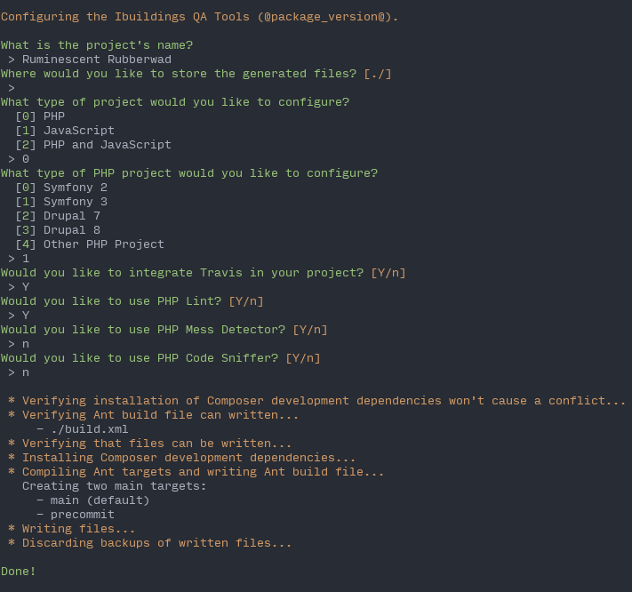

# Ibuildings QA Tools [](https://travis-ci.org/ibuildingsnl/qa-tools)

A set of quality assurance tools that are easily configurable through an installer.

The QA Tools are meant to provide you with a decent base build setup, conforming to Ibuildings standards. 
They are not meant to provide a solution for every use case. If you want a more complex setup,
you can use the resulting configurations as a base and configure it manually.

The official, full documentation can be found on our [GitHub pages][gh-pages].

[gh-pages]: https://ibuildingsnl.github.io/qa-tools

## Requirements

At this moment, QA Tools requires your project to be under Git version control.
Furthermore, it requires you to have a Linuxy environment with the Dash shell
(`sh`), Ant (`ant`), and the common tools `find`, `tr`, and `xargs` in your
[PATH][path]. After installing Ant, QA Tools should work on your Linux or
macOS machine.

## Installation

The recommended way to install the QA Tools is by using our installer:

```
php -r "copy('https://raw.githubusercontent.com/ibuildingsnl/qa-tools/master/installer.php', 'qa-tools-setup.php');"
php -r "if (hash_file('SHA384', 'qa-tools-setup.php') === '46f5c9d6cfe9d6d08759f031ebc251179b87fe8b7a1deccabb68020f1c5b74fb9ce219df4e7341da8cc689118de69ac7') { echo 'Installer verified'; } else { echo 'Installer corrupt'; unlink('qa-tools-setup.php'); } echo PHP_EOL;"
php qa-tools-setup.php
php -r "unlink('qa-tools-setup.php');"
```

If you want, you can use the `--install-dir` option for `qa-tool-setup.php` to indicate where QA tools
should be installed. E.g., `php qa-tools-setup.php --install-dir=/usr/local/bin`. It is recommended you
download QA tools to either your project directory or to some location that is in your [PATH][path].

To see all the options of the installer, run `php qa-tools-setup.php --help`.

Read why we release the QA Tools as a Phar [here](docs/phar.md).

[path]: https://en.wikipedia.org/wiki/PATH_(variable)

## Usage

```sh-session
Usage:
  command [options] [arguments]

Available commands:
  configure             Configure the Ibuildings QA Tools
  self-update           Updates Ibuildings QA Tools to the latest version
  help                  Displays help for a command
  list                  Lists commands
```

The `configure` subcommand will start an interactive questionnaire to help you
quickly configure various QA tools to your project's testing needs. It remembers
your answers, so you can easily reconfigure the tools.



## Upgrading

The QA Tools Phar distributable is self-updateable in a way that is very similar
to Composer. The following command will check the QA Tools'
[Releases][github-qa-releases] page for the latest stable version, and replace
your executable Phar:

```sh-session
$ ./qa-tools.phar self-update
```

## Contributing

 * [Contributing guidelines](CONTRIBUTING.md)
 * [Development](docs/development.md)
    * [Configuration process](docs/development/configuration-process.md)
    * [Task development](docs/development/task-development.md)
    * [Tool development](docs/development/tool-development.md)
    * [Writing system tests](docs/development/writing-system-tests.md)
 * [Phar](docs/phar.md)
 * [Release process](docs/release-process.md)
 * [Reporting a bug](docs/reporting-a-bug.md)
 * [Ubiquitous language](docs/ubiquitous-language.md)
